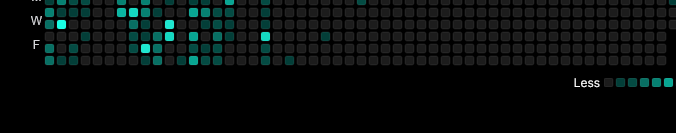
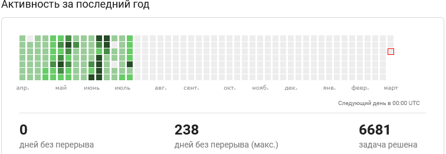

### 
- Я программирую на Python
- Начал заниматься программированием в начале 2023 г.
- Нравиться заниматься самообучением, онлайн сертификаты тут [Stepik](https://stepik.org/users/564742454/profile)

### 
<table border="10" style="max-width: 800px">
<td valign="top" width="20%">

### 
Frontend
 

    
    
    

<td valign="top" width="50%">

### 
Backend

  
    
    
    
    
    
    
    
    
    
    
  

</table>

### 
<table border="10" style="max-width: 800px;">
  <tr>
    <td valign="top" width="35%">
      

        
      

    </td>
    <td valign="top" width="68%">
      
    </td>
  </tr>
</table>

### 
<table border="10" style="max-width: 800px">
  <tr>
    <td valign="top">
      

        
      

    </td>
  </tr>
</table>

### 
<table border="10" style="max-width: 800px">
  <tr>
    <td valign="top">
      

        
      

    </td>
  </tr>
</table>

### 

